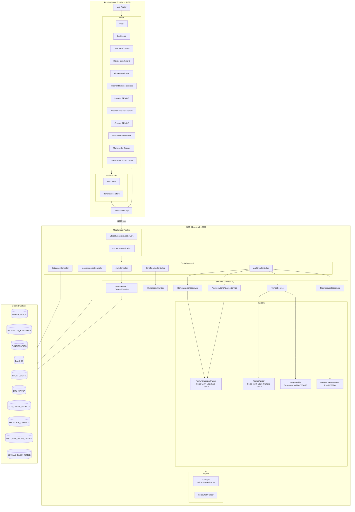
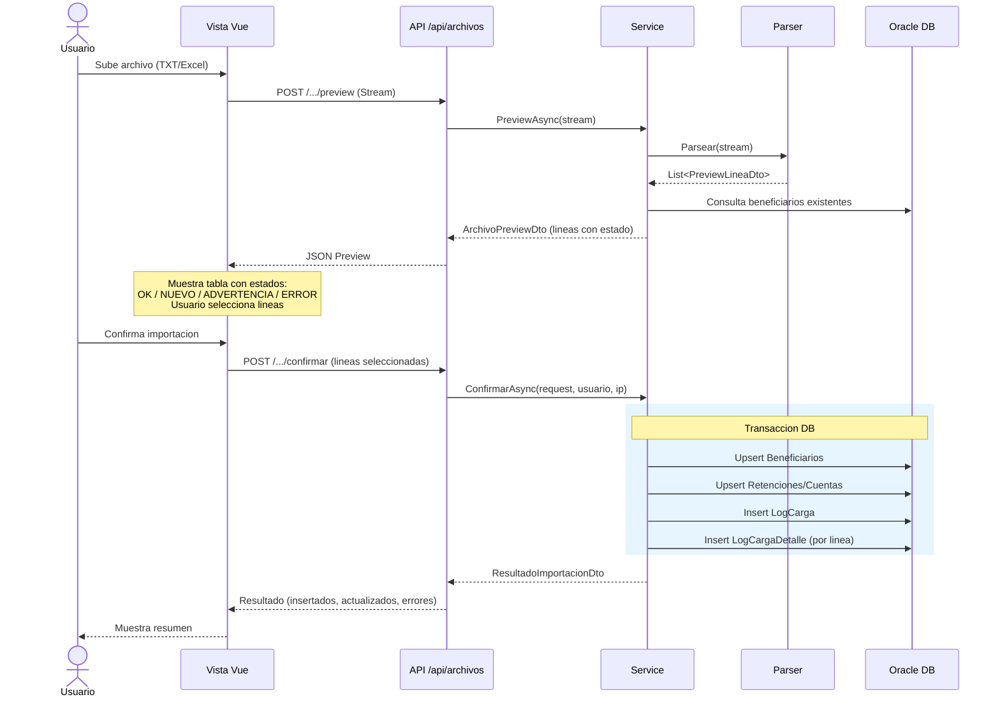
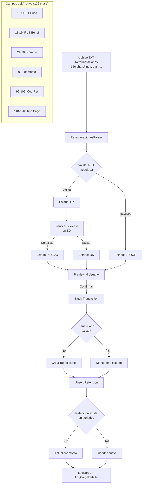
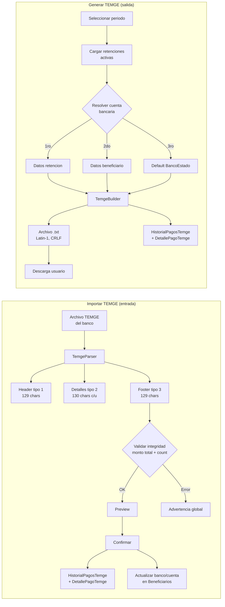
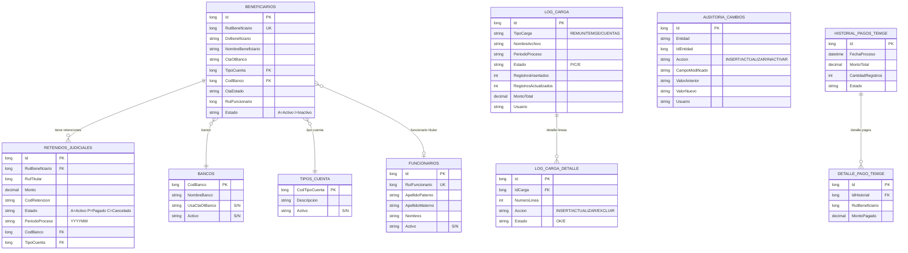
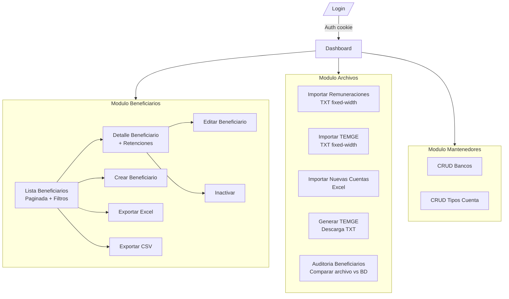
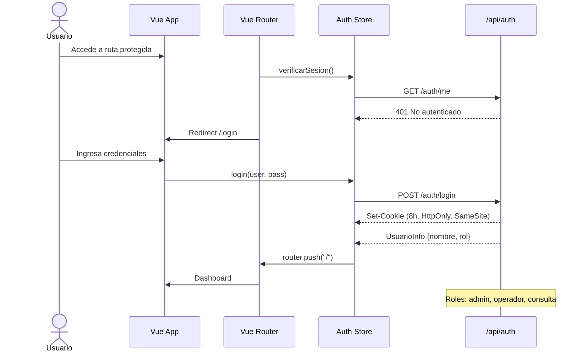
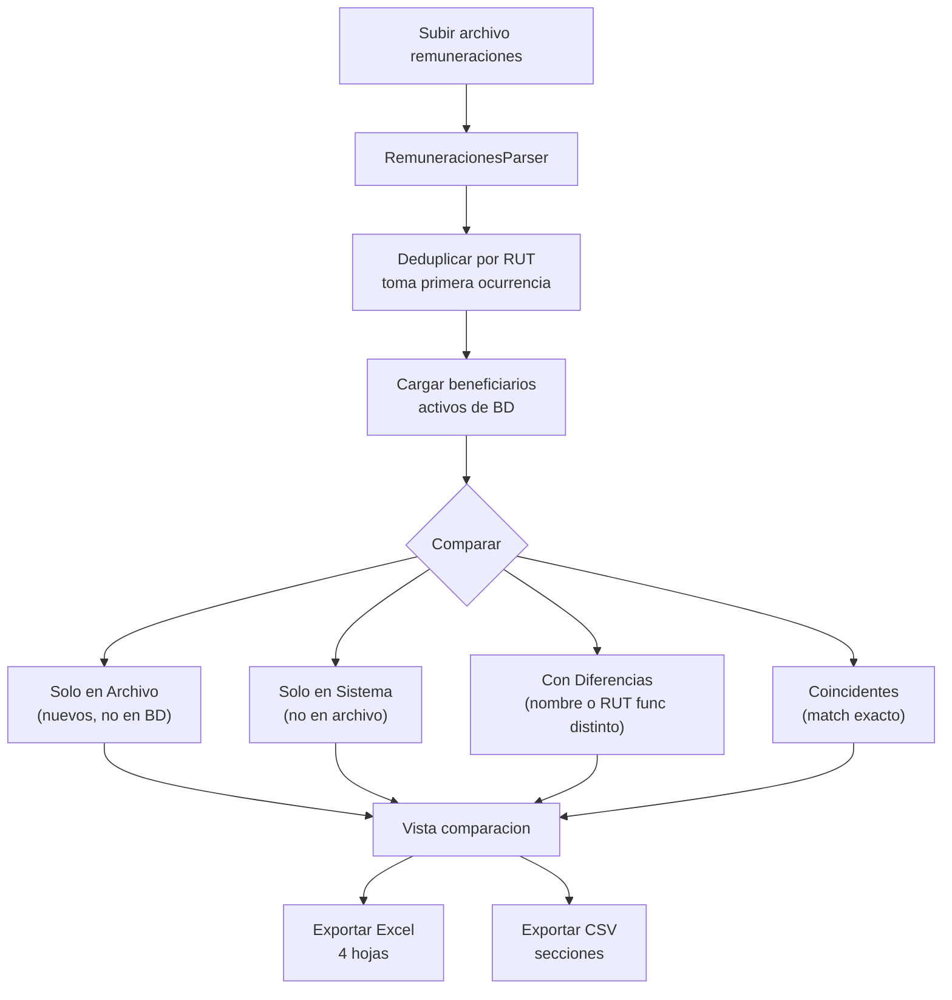

# SRJE - Diagrama de Arquitectura y Flujos

## Arquitectura General

## Flujo de Importacion (Patron Preview-then-Commit)

## Flujo de Remuneraciones (Detallado)

## Flujo TEMGE (Importacion y Generacion)

## Modelo de Datos (Entidades Principales)

## Navegacion Frontend

## Flujo de Autenticacion

## Flujo de Auditoria (Comparacion)

